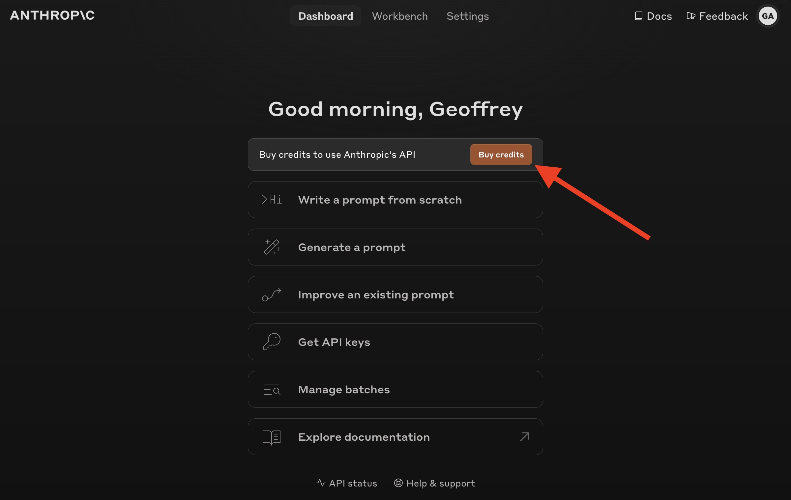
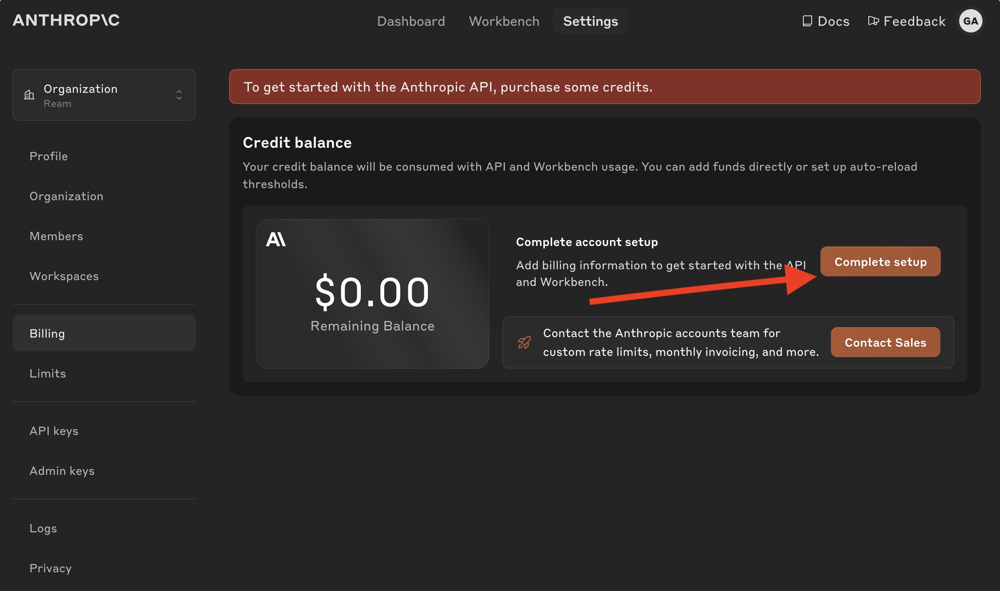
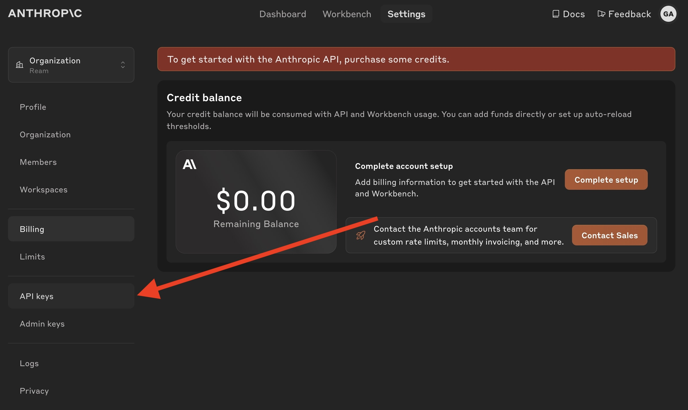
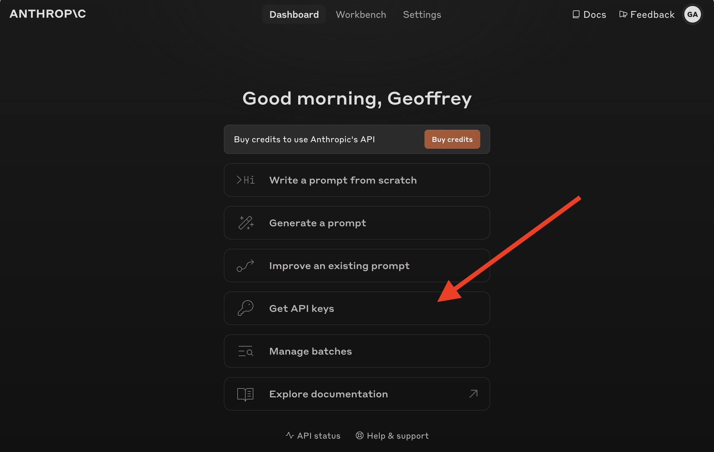
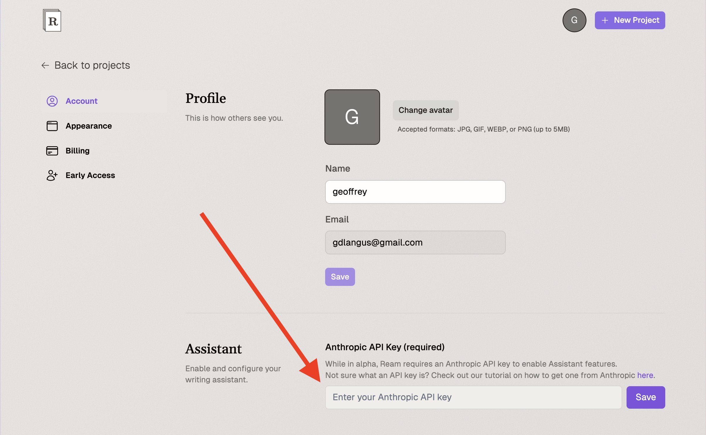
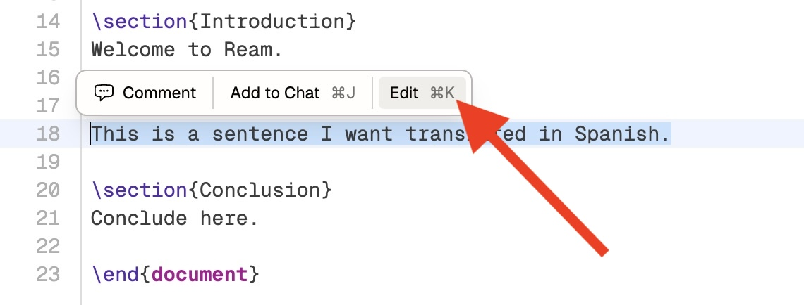

# Assistant

This page describes how to set up and use Ream Assistant.

## Set up

We are still rapidly iterating on the app and experimenting with different pricing models. Until then, AI features can be accessed directly via an Anthropic API key.

### What's an "Anthropic API key"?

Ream Assistant is currently powered by Anthropic's <a href="https://www.anthropic.com/claude" target="_blank">Claude Sonnet 3.5 language model</a> due to its strong LaTeX expertise and low latency responses. An API key is a key that enables the user to use Claude Sonnet in applications beyond Anthropic <a href="https://claude.ai/" target="_blank">chat site</a>. Note: this means that you will be charged according to Anthropic's API <a href="https://www.anthropic.com/pricing" target="_blank">pricing</a>.

### Getting an Anthropic API key

First, create an Anthropic account <a href="https://console.anthropic.com/login" target="_blank">here</a>. 

#### Adding Credits

Before we actually get an Anthropic API key, we have to set up Billing with Anthropic. We do this first to ensure that our API key is immediately usable. You can skip this step if you have already done this.

 

Once you are on the Billing page, complete set up by clicking the button shown below.

#### Creating an API key

Depending on where you are in the Anthropic app, you can find the API button in either the sidebar

 

or, on the list of actions on the welcome page.

Once you are on the API page, click `Create Key` and follow instructions. You can name the key whatever you want, for example "ream-test". We recommend using this API key exclusively for Ream, so that you can track usage and spending in Ream in isolation (you can always make new API keys).

Copy the API key. We recommend not closing the API key pop-up until you have completed uploading it to Ream, because you will not be able to view it again.

Finally, open <a href="https://app.tryream.com/settings/account" target="_blank">Ream account settings</a> and paste your Anthropic API key into the Anthropic API Key field. Click "Save" and Ream Assistant features should now be available in the app!

### Pay-as-you-go pricing

The Anthropic API key charges using pay-as-you-go pricing, meaning that you are charged for the number of tokens used.
Tokens can be thought of as basic units of text; a word tends to be about 2-3 tokens. Output tokens (generations by the Assistant) tend to be charged at a higher rate than input tokens (messages sent to the Assistant). For more information, see Anthropic's <a href="https://www.anthropic.com/pricing#anthropic-api" target="_blank">Pricing Page</a>.

### Rate limits

To mitigate abuse, Anthropic imposes rate limits on the number of requests per minute. If you exceed these limits, you will be rate limited. You can see the rate limits <a href="https://console.anthropic.com/settings/limits" target="_blank">here</a>.

## Edit

One of the most powerful ways to use Ream Assistant is through its Edit capability. Select a bit of text in the editor, then click on the `Edit` button in the pop-up toolbar.

Edits can be accepted, or rejected, or left for later review. Edits left for later review are tracked in the Comments panel of the sidebar. You can also refine the edit made with a follow-up request in the same pop-up.

## Chat

Another, more comprehensive way to interact with Ream Assistant is through the Chat tab.

You can link arbitrary files, images, even PDFs in the Chat window in order to give the Ream Assistant all of the context required to answer your questions.

### Linking Resources

By default, the file you are currently looking at is linked to the Chat, so that Ream Assistant can answer questions based on what you are currently viewing. If you want to link additional resources, you can do so by either adding files to the chat through the selector, or by dragging and dropping files from your computer onto the chat window.

