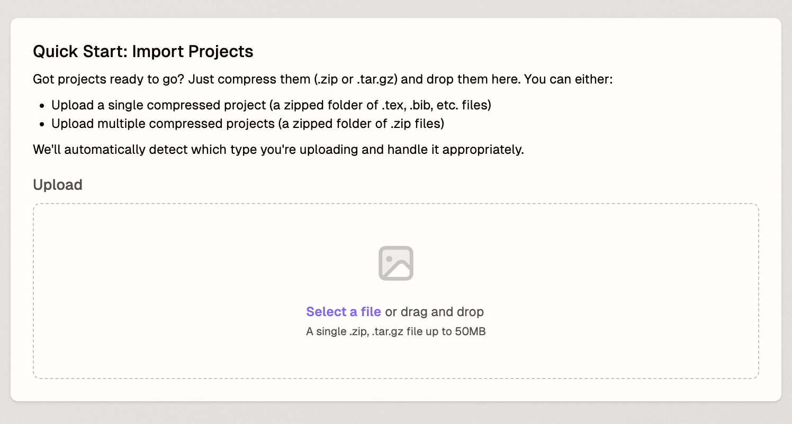
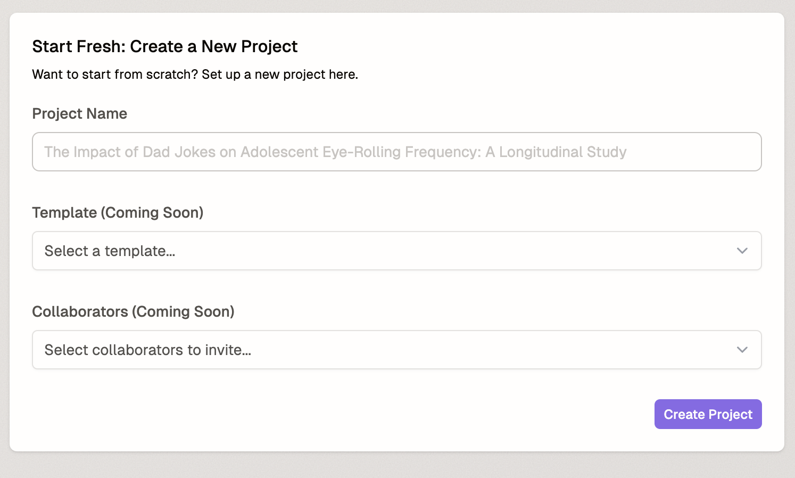
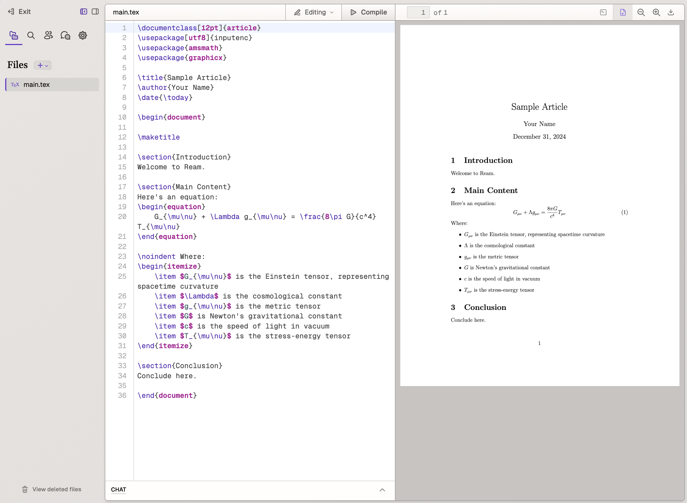

# Getting Started with Ream

Ream is a platform designed to make academic writing easier. This guide will walk you through creating your first project in Ream.

## Creating a New Project

When you first log into Ream, you'll be presented with a welcome screen that invites you to create your first project.

To begin, click the "New Project" button. You'll be presented with two options:

1. Import an existing project
2. Create a new project from scratch

### Importing Projects

If you have existing projects, you can import them by compressing your files (.zip or .tar.gz) and uploading them through the import interface.

The import feature supports:
- Single compressed projects (containing .tex, .bib, and other files)
- Multiple compressed projects (as a zipped folder of .zip files)

Files up to 50MB are supported, and Ream will automatically detect and handle the upload type appropriately.

### Creating a New Project

To start fresh, select "Create a New Project" and you'll see a project setup form.

1. Enter your project name in the provided field
2. Template selection (coming soon)
3. Collaborator invitation (coming soon)

Click "Create Project" to proceed.

### The Editor Interface

After creating your project, you'll be taken to the Ream editor interface where you can begin working on your document.

The editor provides:
- A split-view interface with code on the left and preview on the right
- Built-in LaTeX support
- Real-time preview compilation
- File management tools in the left sidebar
- Compilation controls in the top toolbar

Your new project will start with a basic template that includes:
- Document class and package declarations
- Basic structure with Introduction, Main Content, and Conclusion sections
- Sample equation and formatting examples

## Next Steps

From here, you can:
- Edit the starter template to build your document
- Add new sections and content
- Include mathematical equations and figures
- Compile your document to see the results in real-time

For more detailed information about using specific features, please consult the relevant sections of our documentation.