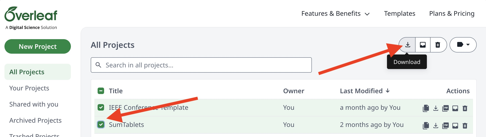
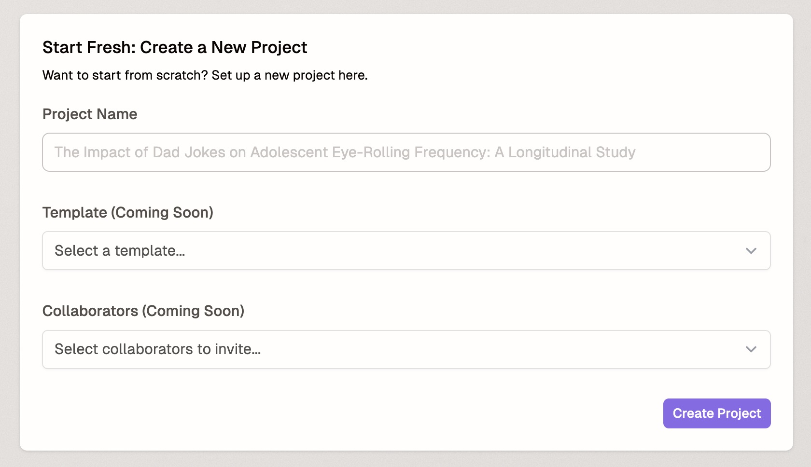

# Getting Started

This page describes how to get started on a new project and how to edit your profile.

## Import from Overleaf

First, go to your Overleaf account and download the projects of interest. You can do this individually by clicking on the "Download" icon on the project's row.

Alternatively, you can select multiple projects and download them in bulk.

 

You should then get a .zip file in your Downloads directory containing your projects. Navigate to Ream and click on the `New Project` button.

Clicking `New Project` should direct you to a page with two options: importing a project or starting one from scratch. Import a project by dragging in your .zip file or by selecting the file.

You should see a preview of the imported projects once upload is completed. From there, select `Confirm Upload`. 

If you uploaded a single project, you will be redirected to the project. If you uploaded projects in bulk, you will be returned to the home page, where you can find the projects in the `My Projects` section.

## Import from ArXiv

First, navigate to the ArXiv paper of interest. Then, click on the `Tex Source` link under the `Access Paper` section of the right sidebar.

You should then get a .zip file in your Downloads directory containing the TeX source of the ArXiv paper. Navigate to Ream and click on the `New Project` button.

Clicking `New Project` should direct you to a page with two options: importing a project or starting one from scratch. Import a project by dragging in your .zip file or by selecting the file.

You should see a preview of the imported projects once upload is completed. From there, select `Confirm Upload`. On upload success, you will be redirected to the project.

## Start from scratch

First, click on the "New Project" button in the top right corner of the home page.

Clicking `New Project` should direct you to a page with two options: importing a project or starting one from scratch. Find the latter option and give your project a name. Then, click `Create Project` in the bottom right corner.

Clicking `Create Project` should redirect you to the project. The default project will render a basic LaTeX template, compiled with `pdflatex`.

## Edit your profile

Click on the user icon at the top of the home page, then click on `Settings`. This will navigate you to the user settings page.

From there, you can edit your avatar and username, update your editor theme, and configure your [Assistant settings](../assistant).

