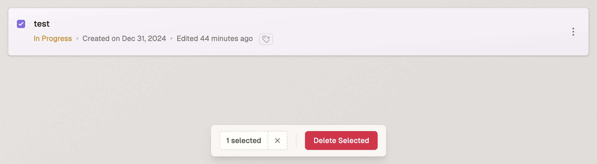
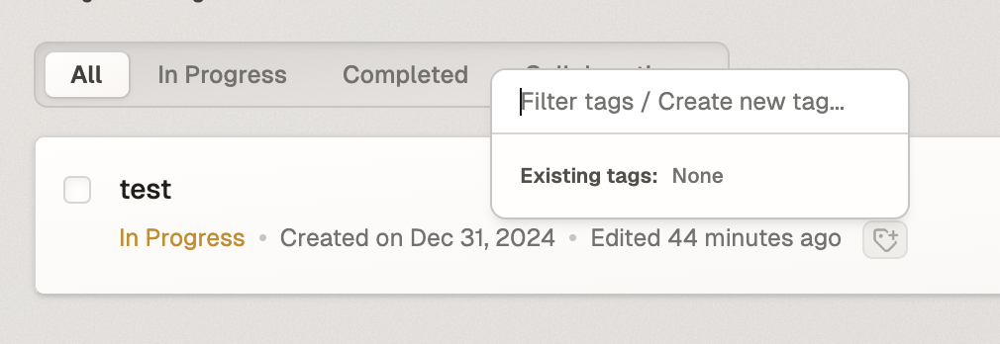
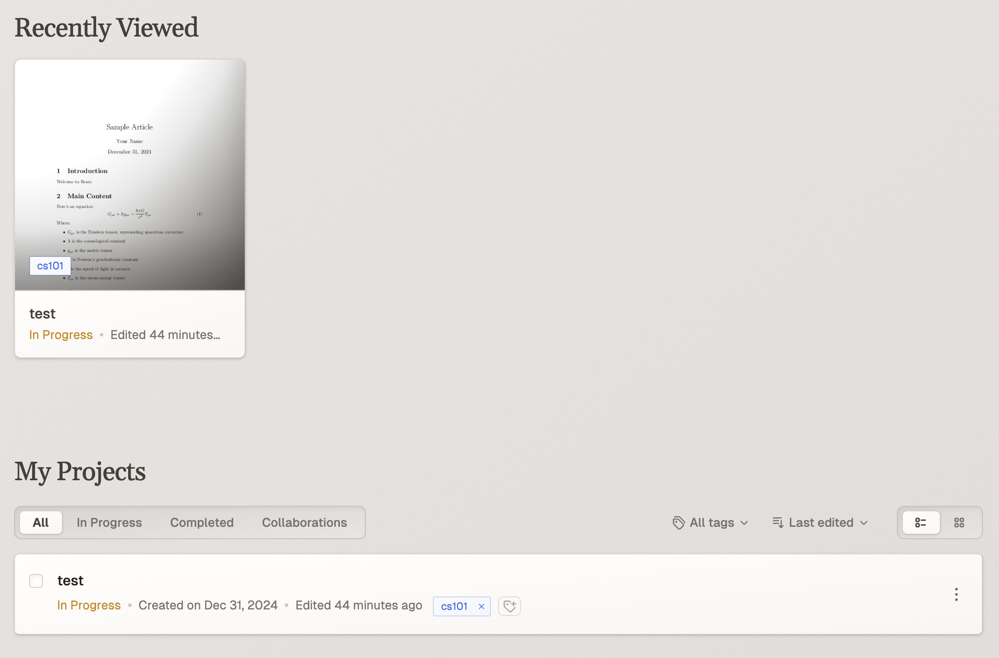
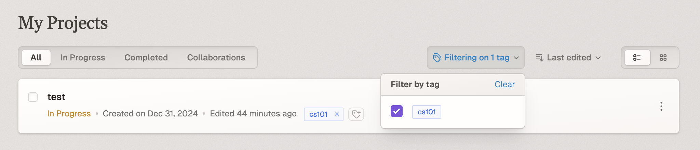
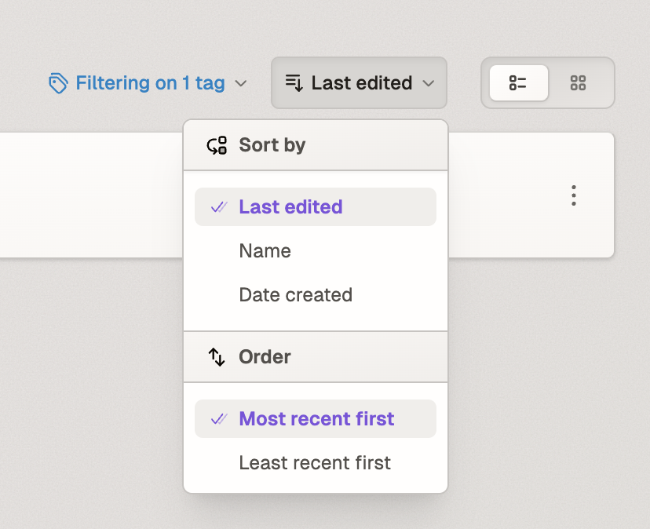
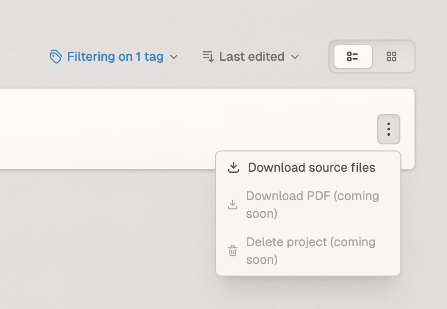

# Managing Projects

## Project Views and Organization

The project management interface consists of two main sections:

1. **Recently Viewed** - Displays up to four of your most recently accessed projects
2. **My Projects** - Contains your complete project list with pagination support

### Project Status Categories

The My Projects section offers four filtering options:

- All
- In Progress
- Completed 
- Collaborations

Project status (In Progress/Completed) is determined by settings within the Editor View. The Collaborations filter shows projects with added collaborators.

## Project Operations

### Deleting Projects

To delete projects:
1. Select one or more projects from the list
2. Click the "Delete Selected" button that appears
3. Confirm deletion in the popup

### Tagging Projects

Tags help organize and filter your projects:

1. Click the Tags button
2. Enter a new tag name (e.g., "CS101") in the tag creation field
3. Tags will appear in both Grid and List views

Tagged projects display their tags in the project list:

## Filtering and Sorting

### Tag Filtering

Use the tag filter to show only projects with specific tags:

### Sort Options

Projects can be sorted by:
- Last edited
- Name
- Date created

And ordered by:
- Most recent first
- Least recent first

### Additional Options

The More Options menu provides additional functionality:
- Download source files
- Download PDF (coming soon)
- Delete project (coming soon)

## Search Functionality

The search toolbar at the top of the interface allows you to quickly find projects by name.

### Project Views

Toggle between two view modes using the buttons in the top-right corner:
- List View
- Grid View

These views provide different ways to visualize your project collection while maintaining all filtering and sorting capabilities.
