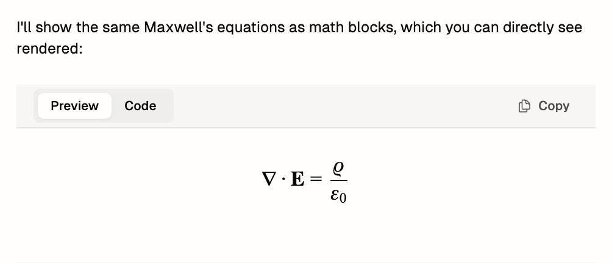
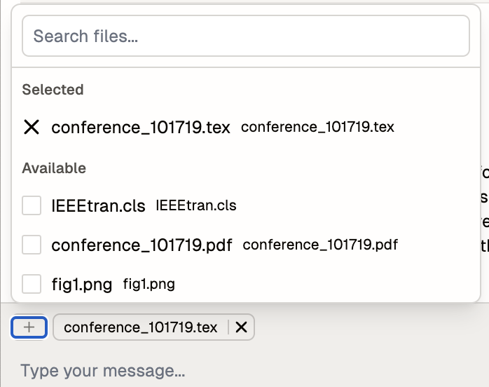

# Chat

## Overview
The Chat interface is an AI-powered assistant integrated into the editor that helps with LaTeX editing, formatting, and general questions. It provides real-time assistance while maintaining context awareness of your project.

## Features

### Basic Chat Interface
**Description:**
The chat system provides a conversational interface similar to ChatGPT for interacting with the AI assistant.

**How to Access:**
The chat window can be accessed by:
- Clicking the collapsible panel at the bottom of the editor
- Using the arrow button on the right side
- Using the keyboard shortcut `Command+J`

**Available Options:**
- Free-form text input for questions
- Support for LaTeX code generation
- Mathematical equation rendering
- Formatting assistance

### Specialized Output Blocks
**Description:**
The assistant can generate two types of specialized content blocks for different purposes.

**Types Available:**
1. Code Blocks
   - Purpose: Display raw LaTeX or other code
   - Features: Includes copy button for easy reuse
   
2. Math Blocks
   - Purpose: Show mathematical equations
   - Features:
     - Preview tab for rendered output
     - Code tab for source view
     - Copy button for code reuse

### Resource Integration
**Description:**
Enables adding context through file linking and resource management.

**How to Use:**
- Click the "Link resource" button
- Search and select project files
- Drag and drop files into chat
- Use the upload image button

**Available Resources:**
- Current file (default)
- Project files
- Images
- PDFs

### Configuration Options
**Description:**
Customizable settings to control the chat assistant's behavior.

**How to Access:**
Click the gear icon in the top bar

**Available Settings:**
1. Project Context
   - Enable/disable project details inclusion
   - Affects package and compiler setting awareness
   
2. Current File Linking
   - Controls current file context inclusion
   - Enabled by default
   
3. Large Resource Handling
   - Optional support for larger text files
   - Disabled by default for performance

## Navigation

The top bar provides additional controls:
- Create new chat session
- View previous chats
- Access chat settings

## Notes
- The credit system is planned for future implementation
- Large resource handling may impact performance and future credit consumption
- Disabling certain features may reduce response quality but could optimize resource usage