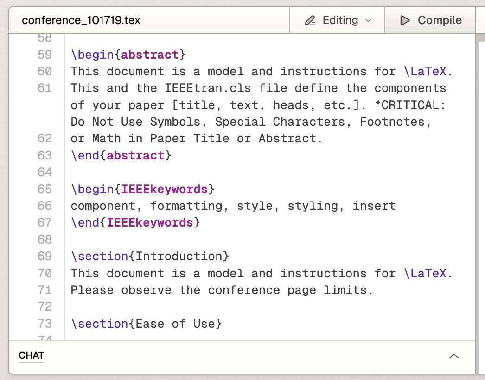
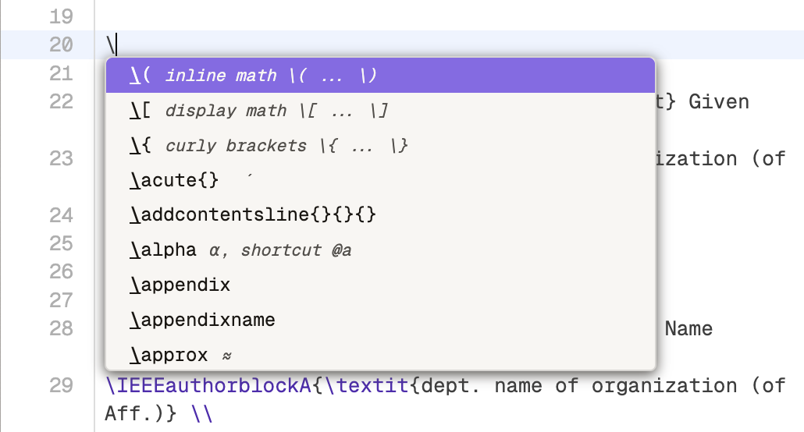
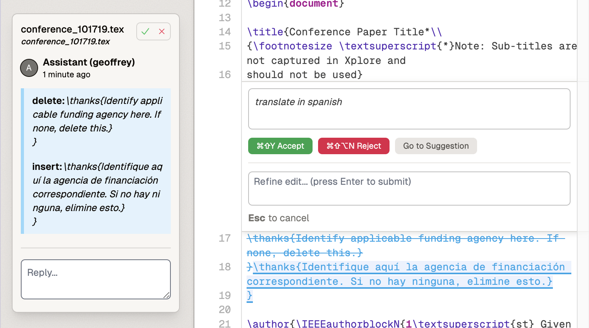

# Editor

## Overview
The Editor is a core component of the platform that enables users to write and edit LaTeX documents efficiently. It combines traditional text editing capabilities with advanced features like syntax highlighting, intelligent autocomplete, and AI-assisted editing tools. The Editor is designed to support both individual writing and collaborative document development.

## Features

### Writing Environment
**Description:**  
The main writing area provides a full-featured environment with syntax highlighting support for multiple file types including LaTeX (.tex), Bibliography (.bib), and Markdown (.md) files.

**How to Access:**  
The writing area is the central component of the Editor panel and appears automatically when you open a document.

**Available Options:**
- Syntax highlighting preferences can be adjusted in Settings
- Multiple file type support
- Real-time preview of formatting

### Search and Replace
**Description:**  
Comprehensive search functionality for both in-file and project-wide text finding and replacement.

**How to Access:**
- In-editor search: Press `Cmd+F`
- Project-wide search: Press `Cmd+Shift+F`

**Available Options:**
- Case sensitive search
- Regular expression support
- Replace single or all occurrences

### Autocomplete
**Description:**  
Intelligent autocomplete system that provides contextual suggestions for LaTeX commands, symbols, and references.

**How to Access:**  
Type a backslash (`\`) to trigger the autocomplete menu.

**Available Options:**
- LaTeX commands and environments
- Mathematical symbols
- Citation suggestions from BibTeX files
- File references for \include commands
- Package and class recommendations

### Selection Menu
When text is selected, a context menu appears offering three options:

1. **Comment**: Opens a new comment in the left sidebar
2. **Add to Chat**: Sends selection to the AI chat window
3. **Edit**: Initiates an AI-powered suggestion workflow

### AI-Assisted Editing

The editor includes an AI assistant that can help with document editing:

#### Making AI-Assisted Edits
1. Select text and choose "Edit" from the context menu
2. Enter editing instructions in the popup window
3. Review the suggested changes
4. Choose to:
   - Accept the suggestion
   - Reject the suggestion
   - Refine the edit with additional instructions
   - View the full suggestion in the comments sidebar

#### Suggestion Management
- AI suggestions appear with blue highlighting
- Human edits appear in green
- Modified AI suggestions are credited to both the AI and human editor
- Suggestions can be accepted or rejected by team members

## Best Practices
- Use the autocomplete feature to reduce typing errors
- Leverage AI assistance for repetitive editing tasks
- Utilize comments for team collaboration
- Review AI suggestions carefully before accepting