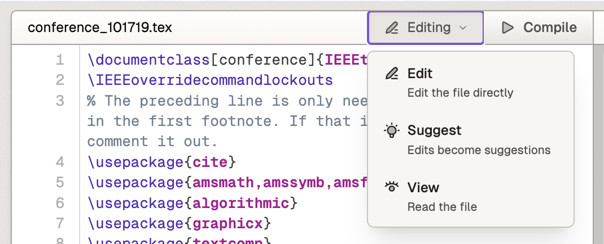

# Editor Top Bar

The top bar contains several important elements:

## File Name Display
- Shows the name of the currently active file
- Clicking the filename reveals its location in the left sidebar's file explorer

## Editing Mode Selector

The editor supports three editing modes:

### 1. Edit Mode
- Default mode for most users
- Allows direct editing of the file contents
- Changes are saved immediately

### 2. Suggest Mode
- Changes appear as suggestions (similar to Google Docs)
- Suggestions are:
  - Compiled by default for preview
  - Visible in the comments section of the left sidebar
  - Can be discussed via threaded comments
  - Can be accepted or rejected
- When suggestions are accepted/rejected:
  - Changes appear in file history
  - The accepter/rejecter is recorded as the change author
  - History can be accessed by right-clicking the file in the explorer

### 3. View Mode
- Makes the file read-only
- Useful for preventing accidental changes to final documents
- Ideal for reviewing camera-ready papers

## Compile Button
- Compiles the project to generate PDF output
- Keyboard shortcuts:
  - Command + Enter
  - Command + S
- Compilation behavior:
  - Processes the root file (containing \documentclass)
  - If multiple root files exist:
    - Prioritizes the currently selected file
    - Will choose one arbitrarily if none selected
  
## Multiple Root Files
While the system supports multiple files with \documentclass declarations:
- Not recommended due to PDF artifact limitations
- Only one PDF can be downloaded at a time
- Switching between root files requires recompilation

*Note: For more detailed information about compilation, please refer to the compilation documentation.*

TODO