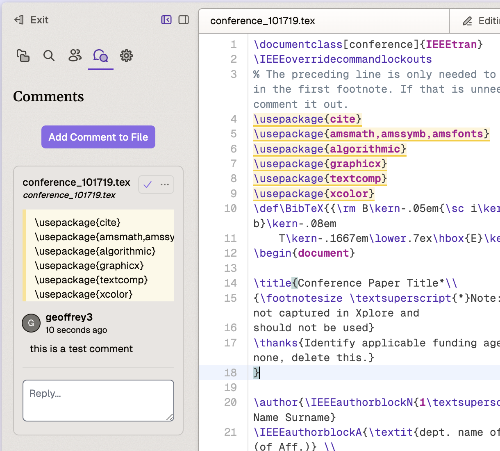

# Comments

## Overview
The Comments feature provides comprehensive annotation and suggestion capabilities similar to Google Docs, enabling users to add, manage, and resolve comments throughout their documents. Comments can be added at both the file level and for specific text selections.

## How to Access
Access the Comments panel through the left sidebar by clicking the Comments icon or using the keyboard shortcut `Ctrl+Shift+C` (Windows/Linux) or `Cmd+Shift+C` (Mac).

## Available Features

### Comment Types
- **File-Level Comments**: Add comments that apply to the entire document
- **Selection Comments**: Add comments to specific text selections within the document

### Core Functions
- **Adding Comments**: 
  - Click "Add Comment to File" for file-level comments
  - Select text and click the comment icon for selection comments
- **Managing Comments**:
  - Reply to existing comments
  - Resolve comments using the checkmark
  - Edit or delete comments via the ellipsis (...) menu
- **Viewing History**: Access resolved comments through "View Resolved Annotations"

### Suggestions Mode
- Create and track proposed text changes
- Review both AI-generated and human suggestions
- Accept or reject suggestions directly in the interface

## Best Practices
- Use file-level comments for general document feedback
- Apply selection comments for specific content feedback
- Resolve comments promptly after addressing them
- Utilize suggestions mode for proposing specific text changes
- Maintain clear and concise comment language
