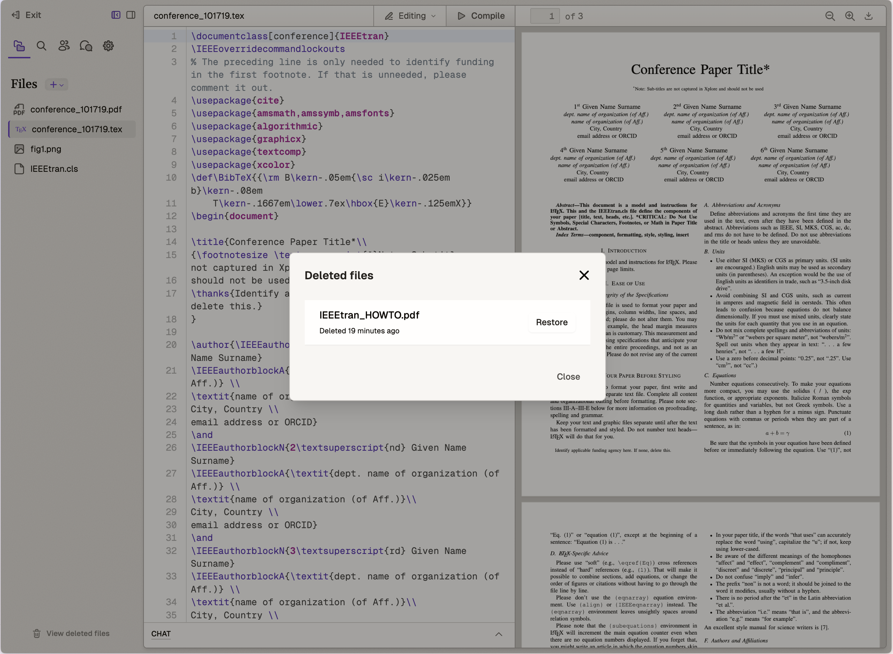

# File Explorer

## Overview
The File Explorer is a core component in Ream's left sidebar that provides comprehensive file management capabilities. It enables users to create, organize, and manage all files within their projects through an intuitive interface.

## Key Features

### File Management Interface
**Description**  
The File Explorer interface provides a hierarchical view of all project files and folders.

**How to Access**  
Located in the left sidebar of the Ream interface, accessible immediately upon opening any project.

**Available Features**
- File tree navigation
- Create new files/folders via the "+" button
- File search functionality
- Deleted files access

### File Operations
**Description**  
Comprehensive set of file management operations accessible through the context menu.

**How to Access**  
Right-click on any file or folder in the File Explorer.

**Available Options**
- Create new files/folders
- Upload files (up to 50MB)
- Rename files/folders
- Delete files/folders
- Download files
- Copy file paths
- View file history

### File History and Recovery
**Description**  
Track changes and restore previous versions of files.

**How to Access**  
Select "Show history" from the file context menu.

**Available Features**
- Version timeline
- Author information
- Version comparison
- File restoration
- Deleted file recovery

## Best Practices
- Organize files in logical folder structures
- Use consistent file naming conventions
- Regularly check deleted files for needed recovery
- Utilize file paths for cross-referencing in documents
- Keep file sizes under 50MB for optimal performance

## Basic Interface

The File Explorer is located in the left sidebar and displays all files in your project. The main interface includes:
- A "+" button for file operations
- A file listing area
- A "View deleted files" button at the bottom

## File Management

### Adding New Files
The "+" button provides three options:
1. Add a new file
2. Add a new folder
3. Upload files

#### File Upload Specifications
- Maximum file size: 50MB
- Supports all file types
- Upload interface appears in a modal window

### File Types

The system handles two main types of files:

#### 1. Editable Files
- Can be opened and modified in the editor
- Includes formats like:
  - LaTeX
  - Markdown
  - Plain text
- Size limitations apply for editability

#### 2. Static Files
- Read-only files
- Typically includes:
  - PNG images
  - PDF documents
  - Large text files
- Used for referencing within projects

## File Operations

### Context Menu
Right-clicking on a file reveals a context menu with the following options:
- Show history (editable files only)
- Rename
- Delete
- Download
- Copy file path

### File History

The file history feature provides:
- Timestamp of changes
- Author information
- Option to restore previous versions
- Version comparison capabilities

### Deleted Files Management

- Access through "View deleted files" button
- Shows list of all deleted files
- Provides option to restore deleted files
- Displays deletion timestamp

## Integration Features

### AI Chat Integration
- Files can be referenced in the AI chat window
- Both static and editable files can be linked
- Provides additional context for AI assistance

### File Path Usage
- Copy file path feature assists in:
  - Including files as project inputs
  - Referencing graphics in documents
  - Creating file references in LaTeX projects

## Additional Notes
- File editability may be limited based on file size
- File paths can be used for cross-referencing within projects
- All operations maintain project history for tracking changes