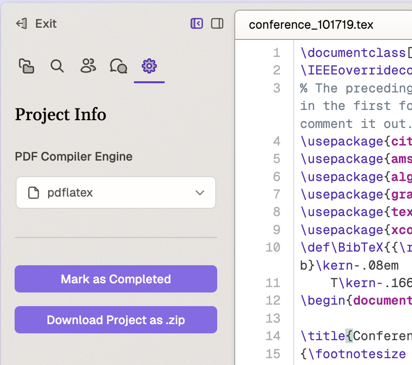

# Project Info

## Overview
The Project Info panel provides essential settings and management options for your LaTeX documents, including compiler selection and project status controls.

## PDF Compiler Engine Selection

### Description
The PDF compiler engine determines how your LaTeX document is processed and compiled into a PDF file. Different engines offer various capabilities and performance characteristics.

### How to Access
Access compiler settings through the "Project Info" panel in the left sidebar by clicking the gear icon.

### Available Options

#### PDF LaTeX (Default)
- Fast and reliable default choice
- Good support for basic LaTeX features
- Recommended for most standard documents

#### XeTeX
- Enhanced Unicode support
- Better handling of modern fonts
- Recommended for:
  - Documents with non-Latin scripts
  - Projects requiring custom fonts

#### LuaTeX
- Supports Lua scripting capabilities
- Handles modern typography features
- Best for:
  - Documents containing emojis
  - Projects requiring Lua scripting
  - Non-standard typography needs
- Note: Slower compilation compared to PDF LaTeX

## Project Management Features

### Description
Project management tools help you organize and track your work progress and export project files when needed.

### Available Features

#### Project Completion Status
- Toggle project completion using the "Mark as Completed" button
- Track project progress from the homepage
- Filter between in-progress and completed projects

#### Project Export
- Download complete project using the "Download Project as .zip" button
- Includes all project source files in compressed format
- Useful for backups and sharing

## Best Practices
- Choose PDF LaTeX for standard documents unless you specifically need features from other engines
- Use XeTeX when working with non-Latin scripts or custom fonts
- Select LuaTeX only when necessary for special typography or Lua scripting needs
- Regularly mark projects as completed to maintain an organized workspace
- Download project archives for backup purposes or when sharing with collaborators
