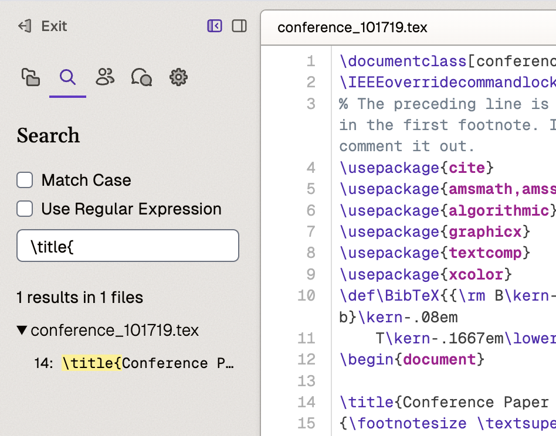

# Search

## Overview

The application provides powerful search capabilities through a dedicated search section in the left sidebar. This section offers features similar to VS Code's search functionality, allowing users to find text across all project files.

## How to Access

- Click the Search icon in the left sidebar
- Use keyboard shortcut: **Command + Shift + F**

## Available Features

### Search Options

The search interface includes two primary toggleable options:

- **Match Case**: Enables case-sensitive searching
  - When enabled: Matches exact uppercase and lowercase characters
  - When disabled: Ignores case differences
- **Use Regular Expression**: Enables regex-based searching
  - Provides real-time validation of regular expressions
  - Shows error messages for invalid patterns

### Search Results Display

- Results are organized hierarchically by file name
- Each file group includes:
  - Collapsible/expandable section
  - Preview of matched content
  - Click-to-navigate functionality

## How to Use

1. Access the search panel using Command + Shift + F
2. Enter your search term in the search bar
3. Toggle desired search options
4. Press Enter to execute the search
5. Click any result to navigate to that location

### Quick Search with Selection
1. Select text in the editor
2. Press Command + Shift + F
3. Search bar automatically populates with selected text

## Best Practices

- Use file group collapsing to manage large result sets
- Leverage regex validation for complex search patterns
- Combine Match Case and Regular Expression for precision
- Start with broad searches and refine as needed
